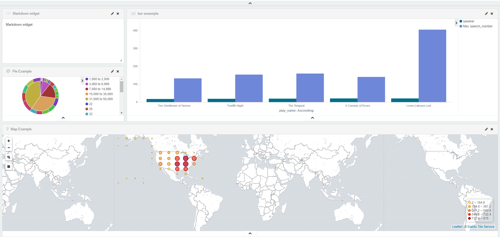
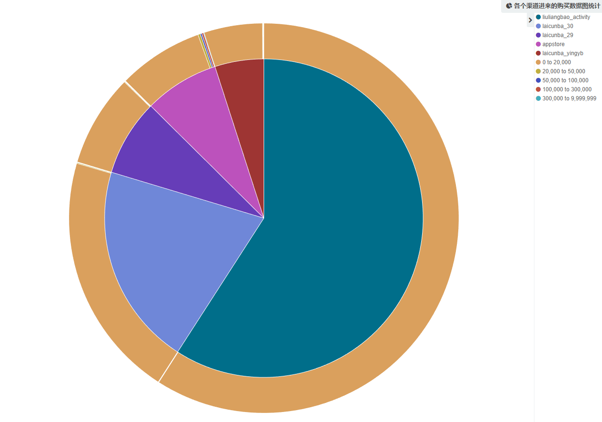

# README 
# 主从同步那个机器更费?
是从服务器

# PostgreSQL bgwriter,walwriter,backend process 写磁盘的实时监控
日志写耗费磁盘
sql写耗费磁盘.

# PostgreSQL , DBA , 日常

背景
1、AWR 数据库健康报告，

《PostgreSQL AWR报告(for 阿里云ApsaraDB PgSQL)》

《如何生成和阅读EnterpriseDB (PPAS(Oracle 兼容版)) AWR诊断报告》

2、查看TOP SQL，以及SQL优化方法

《PostgreSQL 如何查找TOP SQL (例如IO消耗最高的SQL) (包含SQL优化内容) - 珍藏级》

3、监控指标

《PostgreSQL 实时健康监控 大屏 - 低频指标 - 珍藏级》

《PostgreSQL 实时健康监控 大屏 - 高频指标(服务器) - 珍藏级》

《PostgreSQL 实时健康监控 大屏 - 高频指标 - 珍藏级》

4、排查FREEZE引入的IO和CPU飙升，

《PostgreSQL Freeze 风暴预测续 - 珍藏级SQL》

《PostgreSQL freeze 风暴导致的IOPS飙升 - 事后追溯》

5、查看当前慢SQL，长事务，长2PC事务，

例如执行时间超过5秒的QUERY

select pid,state,query_start,xact_start,now()-query_start,wait_event_type,wait_event,query 
from pg_stat_activity where now()-query_start > '5 s' order by query_start;  
select * from pg_prepared_xacts ;  
6、根据PID杀会话或QUERY，

查询当前系统在执行的SQL，PID。（普通用户无法查看其它用户执行的QUERY）

select pid,state,query_start,xact_start,now()-query_start,wait_event_type,wait_event,query from pg_stat_activity order by query_start;  
KILL QUERY

select pg_cancel_backend(pid);  
KILL 会话

select pg_terminate_backend(pid);  
7、查看膨胀的表和索引，截取自bucardo开源的check_postgres

《如何检测、清理膨胀、垃圾(含修改分布键) - 阿里云HybridDB for PG最佳实践》

8、不堵塞DML的并行建索引方法，

加索引时，可以使用CONCURRENTLY语法，不堵塞DML操作。

Command:     CREATE INDEX     
Description: define a new index     
Syntax:     
CREATE [ UNIQUE ] INDEX [ CONCURRENTLY ] [ [ IF NOT EXISTS ] name ] ON table_name [ USING method ]     
    ( { column_name | ( expression ) } [ COLLATE collation ] [ opclass ] [ ASC | DESC ] [ NULLS { FIRST | LAST } ] [, ...] )     
    [ WITH ( storage_parameter = value [, ... ] ) ]     
    [ TABLESPACE tablespace_name ]     
    [ WHERE predicate ]     
9、索引自动推荐

《PostgreSQL 商用版本EPAS(阿里云ppas(Oracle 兼容版)) 索引推荐功能使用》

《PostgreSQL SQL自动优化案例 - 极简，自动推荐索引》

10、系统瓶颈或数据库代码瓶颈

《PostgreSQL 源码性能诊断(perf profiling)指南 - 珍藏级》

《PostgreSQL 代码性能诊断之 - OProfile & Systemtap》

11、锁等待排查

如果你发现数据库CPU,IO都不高，但是性能不行，或者连接打满，或者SQL执行HANG死的情况，通常是锁等待造成。

《PostgreSQL 锁等待监控 珍藏级SQL - 谁堵塞了谁》

12、防雪崩方法

设置语句超时，锁等待超级可解，特别是对于DDL语句，一定要设置锁等待超时，否则业务高峰期，如果有高并发的其他QUERY访问DDL的表可能会导致雪崩。

《PostgreSQL 设置单条SQL的执行超时 - 防雪崩》

《如何防止数据库雪崩(泛洪 flood)》

13、GIN索引pending页，直接导致GIN索引查询效率变差

《PostgreSQL pageinspect 诊断与优化GIN (倒排) 索引合并延迟导致的查询性能下降问题》

通常可能是大量并发写入数据，AUTOVACUUM WORKER来不及合并GIN PENDING LIST造成。

14、曾经的慢SQL为什么慢

历史慢SQL，通过auto_explain可以记录慢SQL的整个执行计划，包括执行计划里面每一个步骤花费的时间，消耗的IO时间，IO命中率等。

《PostgreSQL 函数调试、诊断、优化 & auto_explain & plprofiler》

# PostgreSQL , 实时轨迹 , IoT , 车联网 , GIS

背景
车联网，IoT场景中，终端为传感器，采集各个指标的数据（同时包括时间、GIS位置信息，速度，油耗，温度，EDU采集指标），在运动过程中，通过GPS准实时上报到服务端。

服务端则通常根据设备（比如车辆）、时间范围，查询指定设备在某个时间区间的行程。

例如：

1、设备轨迹点表

create table tbl (  
  id int primary key,  -- 主键  
  sid int,  -- 传感器（车辆）ID  
  xxx int,  -- 行程ID  
  geo geometry,  -- 位置  
  att jsonb,  -- 属性  
  crt_time timestamp  -- 时间  
);  
2、查询

select * from tbl where sid=? and crt_time between x and y;  
这种方法的问题（一个点一条记录）：

1、查询性能问题，有IO放大（因为传感器都活跃），一个行程的每个点都落在不同的BLOCK里面，查询有IO放大。

2、空间占用，一个点一条记录，压缩比低。

3、行程运算，行程的所有点没有合并，运算效率差。

行程合并问题
为了解决以上问题，可以新建行程表，并将点的数据合并到行程。

create table tbl_agg (  
  xxx int,  -- 行程ID  
  geo 轨迹类型, -- 轨迹  
  agg jsonb[]  -- 其他属性聚合  
)  
例如，每隔N秒，将点表的数据，按行程ID为主键更新到行程表。

insert into tbl_agg on conflict (geo) do ?   
select xxx,geo_agg(geo),jsonb_agg(jsonb) from tbl where crt_time between ? and ?;  
这种做法有性能问题：

1、锁

如果并发聚合的话，很显然可能多个会话中会出现同样的xxx行程ID字段，所以会有锁冲突。

2、IO放大

如果要解决锁的问题，我们可以用HASH，每个会话算其中的一个HASH value，但是这样就会导致扫描时IO放大，例如8个并行，则有效数据仅八分之一。相当于IO多扫描了7次。

3、CPU只能用一核

为了解决第一个问题，也可以使用串行方法，串行就只能用一核。

4、GAP，由于时间差的问题（例如INSERT到达的数据有错乱，那么可能导致中间出现GAP，聚合的行程缺少一些点）

5、实时性，异步合并到行程表，显然，查询行程表时，可能还有一些POINT没有合并进来，那么就会导致即刻查询行程缺少最近没有合并的点（延迟）。

行程合并优化
为了解决前面提到的5个问题。行程合并的流程可以优化。

1、点表分区，对点表进行分区。按行程ID HASH。

create table tbl (like old_tbl including defaults) partition by list (abs(mod(hashtext(行程字段),16)));   
  
do language plpgsql $$  
declare  
begin  
  for i in 0..15 loop  
    execute 'create table tbl_'||i||' partition of tbl for values in ('||i||')';  
    execute 'create index idx_tbl_'||i||'_1 on tbl_'||i||' (id)';  
    execute 'create index idx_tbl_'||i||'_2 on tbl_'||i||' (crt_time)';  
  end loop;  
end;  
$$;  
2、由于点表分区了，而且行程ID HASH分区，每个分区一个行程合并处理进程（没有锁的问题），总共就可以开多个并行来提高合并行程的处理并行度。提高整体合并行程的性能。

3、行程表，分区。解决行程表垃圾回收的问题。

行程是UPDATE（APPEND POINT到行程类型中）的形式，所以UPDATE会很多，会经常需要对行程表进行VACUUM。

如果行程表不分区，行程表就会很大，目前PG的VACUUM，对于单个表来说，同一时间只能一个核来进行垃圾回收，还没有支持单表并行VACUUM。

所以行程表如果很大，并且需要频繁垃圾回收时，为了避免垃圾回收速度赶不上垃圾产生速度，同样也可以使用分区。

与点表分区类似，最好使用一样的分区键。 

# 根据索引对表进行聚类

 

cluster指示postgresql根据index_name指定的索引对table_name指定的表进行集群。表上必须已经有索引。

当表被cluster时，它将根据索引信息进行物理重新排序。cluster是一次性操作：当表随后被更新时，更新不会被cluster。也就是说，不尝试根据新行或更新行的索引顺序存储新行或更新行。如果愿意，可以通过再次发出命令来定期重新调整。此外，将表的填满因子存储参数设置为小于100%有助于在更新期间保留群集顺序，因为如果有足够的空间，更新的行将保留在同一页上。）

当一个表被cluster 时，PostgreSQL会记住它被cluster 的索引。表单cluster table_name使用与以前相同的索引重新排序表。您还可以使用 cluster 或set without cluster form of alter table来设置将来cluster 操作要使用的索引，或者清除任何以前的设置。

不带任何参数的CLUSTER将重新对调用用户拥有的当前数据库中以前的所有聚集表进行排序，或者对超级用户调用的所有此类表进行排序。这种形式的集群不能在事务块内执行。

当一个表被cluster 时，它会获得一个访问排它锁。这将防止在集群完成之前对表进行任何其他数据库操作（读和写）。

 

执行参数：

table_name: 表名

index_name: 索引名。

berbose: 在每个表都聚集时打印进度报告。

 

在随机访问表中的单行的情况下，表中数据的实际顺序并不重要。但是，如果倾向于比其他人更多地访问一些数据，并且有一个索引将这些数据分组在一起，那么将从使用cluster中获益。如果从一个表中请求一个索引值范围，或者一个索引值有多个匹配的行，那么cluster将有所帮助，因为一旦索引为第一个匹配的行标识了表页，那么所有其他匹配的行可能已经在同一个表页上，因此可以保存磁盘访问并加快查询速度。

cluster 可以使用对指定索引的索引扫描，或者（如果索引是B树）顺序扫描，然后进行排序，对表进行重新排序。它将根据计划成本参数和可用的统计信息，尝试选择更快的方法。

使用索引扫描时，将创建一个临时表副本，其中包含按索引顺序排列的表数据。还将创建表上每个索引的临时副本。因此，您需要磁盘上的可用空间至少等于表大小和索引大小之和。

当使用顺序扫描和排序时，也会创建一个临时排序文件，以便峰值临时空间需求是表大小的两倍，加上索引大小。此方法通常比索引扫描方法快，但如果磁盘空间要求不可容忍，则可以通过暂时将“enable_sort”设置为“off”来禁用此选项。

建议在cluster 之前将 maintenance_work_mem 设置为一个相当大的值（但不超过您可以专门用于集群操作的RAM数量）。

因为计划器记录有关表顺序的统计信息，所以建议对新cluster 的表运行分析。否则，计划者可能会对查询计划做出错误的选择。

因为cluster 记住了哪些索引是cluster 的，所以可以对第一次需要手动cluster 的表进行cluster ，然后设置一个周期性维护脚本，在不使用任何参数的情况下执行集群，以便周期性地重新集群所需的表。

 

===========================================================================================

 

-- 实验环境：CentOS 7 + PG 11.1
-- 说明：实验SQL是根据 digoal 的实验，自己亲手做的。感谢德哥！！！
-- 创建实验表，索引
create table test (id int, val numeric);
create index on test(id);
create index on test(val);
 
-- 插入实验数据
insert into test select generate_series(1,10000000),random();
 
-- 表信息
\d test
                Table "public.test"
 Column |  Type   | Collation | Nullable | Default
--------+---------+-----------+----------+---------
 id     | integer |           |          |
 val    | numeric |           |          |
Indexes:
    "test_id_idx" btree (id)
    "test_val_idx" btree (val)
 
-- 表文件
select pg_relation_filepath('test'::regclass);
 pg_relation_filepath
----------------------
 base/16385/64278
(1 row)
-- 索引文件
select pg_relation_filepath('test_id_idx'::regclass);
 pg_relation_filepath
----------------------
 base/16385/64280
(1 row)
-- 索引文件
select pg_relation_filepath('test_val_idx'::regclass);
 pg_relation_filepath
----------------------
 base/16385/64281
(1 row)
 
 
-- 查看列的离散程度，值越接近0，表示越离散，越接近1，表示存储比较有顺序
-- 说明目前表是根据 id 有序存储的。
select correlation from pg_stats where tablename='test' and attname='id';
 correlation
-------------
           1
 
select correlation from pg_stats where tablename='test' and attname='val';
 correlation
-------------
  0.00781794
(1 row)
 
-- 收缩表，分析表，收集统计信息。
vacuum analyze test;
 
-- 最小的ID的存储位置
select ctid,id,val from test where id=(select min(id) from test);
 ctid  | id |        val
-------+----+-------------------
 (0,1) |  1 | 0.419486843980849
(1 row)
 
-- 最小的 VAL 的存储位置
select ctid,id,val from test where val=(select min(val) from test);
    ctid    |   id   |          val
------------+--------+------------------------
 (4361,127) | 806540 | 0.00000218348577618599
(1 row)
 
 
-- 根据 val 列上的索引。做cluster。
cluster test USING test_val_idx;
 
-- 查看最小 id 的存储
select ctid,id,val from test where id=(select min(id) from test);
   ctid   | id |        val
----------+----+-------------------
 (3192,7) |  1 | 0.589303761254996
(1 row)
 
-- 查看最小 val 的存储
select ctid,id,val from test where val=(select min(val) from test);
 ctid  |   id   |          val
-------+--------+------------------------
 (0,1) | 806540 | 0.00000218348577618599
(1 row)
 
-- 收缩表，分析表，收集统计信息。
vacuum analyze test;
 
-- 查看列的离散程度，值越接近0，表示越离散，越接近1，表示存储比较有顺序
-- 说明目前表是根据 val 有序存储的。
select correlation from pg_stats where tablename='test' and attname='val';
 correlation
-------------
           1
(1 row)
 
select correlation from pg_stats where tablename='test' and attname='id';
 correlation
-------------
  0.00133778
(1 row)
 
-- 查询表，索引文件，都变了。说明cluster重建表和索引。
select pg_relation_filepath('test'::regclass);
 pg_relation_filepath
----------------------
 base/16385/64283
(1 row)
 
select pg_relation_filepath('test_id_idx'::regclass);
 pg_relation_filepath
----------------------
 base/16385/64289
(1 row)
 
select pg_relation_filepath('test_val_idx'::regclass);
 pg_relation_filepath
----------------------
 base/16385/64290
(1 row)
 
-- 表锁
-- session 1
mytest=# begin;
BEGIN
mytest=# cluster test USING test_id_idx ;
CLUSTER
 
-- session 2
mytest=# select * from test limit 1;
等待......
 
-- session 3
select pid,locktype,database,relation,granted,mode,b.relname from pg_locks a,pg_class b where a.relation=b.oid;
  pid  | locktype | database | relation | granted |        mode         |              relname
-------+----------+----------+----------+---------+---------------------+-----------------------------------
 22891 | relation |    16385 |     3455 | t       | AccessShareLock     | pg_class_tblspc_relfilenode_index
 22891 | relation |    16385 |     2663 | t       | AccessShareLock     | pg_class_relname_nsp_index
 22891 | relation |    16385 |     2662 | t       | AccessShareLock     | pg_class_oid_index
 22891 | relation |    16385 |     1259 | t       | AccessShareLock     | pg_class
 22891 | relation |    16385 |    11645 | t       | AccessShareLock     | pg_locks
 21609 | relation |    16385 |     2679 | t       | AccessShareLock     | pg_index_indexrelid_index
 21609 | relation |    16385 |     2678 | t       | AccessShareLock     | pg_index_indrelid_index
 21609 | relation |    16385 |     2610 | t       | AccessShareLock     | pg_index
 21609 | relation |    16385 |     3455 | t       | AccessShareLock     | pg_class_tblspc_relfilenode_index
 21609 | relation |    16385 |     2663 | t       | AccessShareLock     | pg_class_relname_nsp_index
 21609 | relation |    16385 |     2662 | t       | AccessShareLock     | pg_class_oid_index
 21609 | relation |    16385 |     2685 | t       | AccessShareLock     | pg_namespace_oid_index
 21609 | relation |    16385 |     2684 | t       | AccessShareLock     | pg_namespace_nspname_index
 21609 | relation |    16385 |     2615 | t       | AccessShareLock     | pg_namespace
 21609 | relation |    16385 |     1259 | t       | AccessShareLock     | pg_class
 21609 | relation |    16385 |    64276 | t       | AccessShareLock     | test_val_idx
 21609 | relation |    16385 |    64276 | t       | AccessExclusiveLock | test_val_idx
 21609 | relation |    16385 |    64272 | t       | AccessExclusiveLock | pg_toast_64269
 21609 | relation |    16385 |    64275 | t       | AccessShareLock     | test_id_idx
 21609 | relation |    16385 |    64275 | t       | AccessExclusiveLock | test_id_idx
 21609 | relation |    16385 |    64269 | t       | ShareLock           | test
 21609 | relation |    16385 |    64269 | t       | AccessExclusiveLock | test
 22829 | relation |    16385 |    64269 | f       | AccessShareLock     | test
(23 rows)
 
————————————————
版权声明：本文为CSDN博主「Chuck_Chen1222」的原创文章，遵循 CC 4.0 BY-SA 版权协议，转载请附上原文出处链接及本声明。
原文链接：https://blog.csdn.net/chuckchen1222/article/details/85630528
# PostgreSQL , 资源 , 性能 , 抖动 , 评估 , 稳定性

背景
在数据库压测过程中，经常会遇到抖动的问题。为什么数据库会出现抖动呢？

持续高水位压测（把资源用个精光）会抖，数据库后台进程要做检查点，垃圾回收，刷脏，操作系统也有回收脏页的操作。

由于压测时把所有资源都用光了，当后台需要进行刷脏，做检查点，垃圾回收等动作时，就会出现资源抢占，当然会导致性能的抖动。

如何看待抖动
关于数据库负载，长时间高水位运转带来的抖动问题，实际上就是资源用太多的问题。

为了评估一个比较合理的硬件资源，应该考虑高峰期业务持续时间，预留一定的资源配比。

留给谁用呢？

freeze, 备份，standby，系统进程(后台进程要做检查点，垃圾回收，刷脏，操作系统也有回收脏页)。

短暂的高水位运转可以接受的，如果业务持续高水位运作，就需要考虑加资源或者拆分了。

This README would normally document whatever steps are necessary to get the
application up and running.

Things you may want to cover:

* Ruby version

* System dependencies

* Configuration

* Database creation

* Database initialization

* How to run the test suite

* Services (job queues, cache servers, search engines, etc.)

* Deployment instructions

* ...

* 您需要在mac的电脑上安装好打包用的证书.nginx 服务器.然后把ipa的文件共享出来提供给测试提交服务器下载.

* 安卓打包服务器192.168.199.254 安装有nginx提供apk python3 autoit程序

* ios打包服务器192.168.199.231 安装有nginx提供ipa

* 测试服务器192.168.199.254 提交各个代码到各大云平台去测试 并提供h5接口的自动化测试

* 测试服务器192.168.199.125 安装网易mumu模拟器 提供安卓 和h5的自动化测试

* 数据抓取服务器173 安装python3 autoit 抓取友盟 aso100等数据

* 日志抓取采用elk服务器146 编写各种规则 最后提交到本数据库

* 本数据库对各项服务进行整合。并展现报表

* mqc上测试去编写测试用例

* 本软件提供的功能 安卓 ios自动打包分享测试。自动脚本的执行

* 脚本的计划任务和基本配置 采用蓝鲸平台

* elk服务器执行和展现图标

export PGPASSWORD=112233
pg_dump --host 10.154.24 --port 1921 --username laicunba_web -d laicunba> laicunba_20160123_1217.dmp

从从服务器备份数据
export PGPASSWORD=112233
psql -U postgres -p 5433 laicunba_test < laicunba_20160123_1217.dmp 

从服务器上导入数据

CREATE TABLE films_recent AS SELECT usr.mobile,usr.channel,sum_amount from(SELECT usr.mobile,sum(tt.amount)as sum_amount from(SELECT bid_user_id as user_id,SUM (lcb_financing_target_bid.buy_amount - COALESCE (lcb_financing_target_bid.withdraw_principal,0)) as amount FROM lcb_financing_target_bid WHERE lcb_financing_target_bid.pay AND (lcb_financing_target_bid.pay_mark IN ('DEMAND_2_FIX','FIX_BID_2_DEMAND','自动购买' )OR lcb_financing_target_bid.bank_card_no IS NOT NULL)  AND lcb_financing_target_bid.buy_amount > lcb_financing_target_bid.withdraw_principal GROUP BY bid_user_id UNION ALL select user_id, sum(COALESCE(lcb_withdraw_financing_target_bid_item.withdraw_principal,0)) as amount from lcb_withdraw_financing_target_bid_item LEFT JOIN lcb_withdraw on lcb_withdraw_financing_target_bid_item.withdraw_id=lcb_withdraw.id where lcb_withdraw.TYPE = 'SCB' AND lcb_withdraw.status = 'apply' GROUP BY user_id  UNION ALL SELECT id as user_id, COALESCE (lcb_user.remain_profit, 0)as amount FROM lcb_user UNION ALL select id as user_id,balance as amount from lcb_current_account UNION ALL select user_id,COALESCE(sum(withdraw_principal),0)as amount from lcb_withdraw  where type='CA' and status='apply' GROUP BY user_id) as tt LEFT JOIN lcb_user usr ON usr.id=tt.user_id GROUP BY usr.mobile) as foo LEFT JOIN lcb_user usr ON usr.mobile=foo.mobile ORDER BY usr.channel

数据先生成临时表

#!/bin/bash

#curl -XDELETE 'http://:9200/chaxuncunliangzijin'

DIR="$( cd "$( dirname "${BASH_SOURCE[0]}" )" && pwd )"
bin=${DIR}/../bin
lib=${DIR}/../lib

echo '{
    "type" : "jdbc",
        "jdbc" : {
                "url" : "jdbc:postgresql://localhost:5/laicunba_test?loglevel=0",
                "user" : "po",
                "password" : "a",
                "sql" : "SELECT * from films_recent",

                "elasticsearch" : {
                         "cluster" : "elasticsearch",
                         "host" : "10.47.66.53",
                         "port" : 9300
                },
                "index" : "chaxuncunliangzijin",
                "type" : "mytype",
                "index_settings" : {
                        "index" : {
                                "number_of_shards" : 1
                        }
                },
                "type_mapping": {
                        "mytype" : {
                                "properties" : {
                                        "polygon" : {
                                                "type" : "geo_shape",
                                                "tree" : "quadtree"
                                        }
                                }
                        }
                }
        }

}
' | java \
    -cp "${lib}/*" \
    -Dlog4j.configurationFile=${bin}/log4j2.xml \
    org.xbib.tools.Runner \
    org.xbib.tools.JDBCImporter

临时表导入到es数据库.最后在kibana上通过鼠标点击的方式生成图表

测试首先需要打包.打包和测试是一个比较繁琐的任务.之前我们持续集成中这些代码都是人工打包的.现在做成代码进行持续集成.持续集成能大大提高程序开发的速度.在bug发现和处理方面解决人力支出的部分.推动公司开发的速度.现在一个程序员薪水就是几万. 本次代码替代了ios程序员和安卓程序员 测试工程师.手工测试的部分.实乃杀价越活的必备良器.
这段代码是windows下的打包程序
用批处理语言写的
set /a TODAY=%date:~0,4%%date:~5,2%%date:~8,2% 
set _TIME=%time:~0,8% 
set CURRENTTIME=%_time::=% 
set CURRENTTIME=%CURRENTTIME: =0% 
set MYDIR=%TODAY%_%CURRENTTIME% 
echo %MYDIR%
d:

cd /laicunba_android_studio
rd /q/s D:\laicunba_android_studio\app\build\outputs\apk

copy /y d:\bijiao1.txt d:\bijiao2.txt
svn cleanup

svn update>d:\bijiao1.txt
sed -i 's/minifyEnabled true/minifyEnabled false/g' D:\laicunba_android_studio\app\build.gradle
#sed -i 's/minifyEnabled false/minifyEnabled true/g' D:\laicunba_android_studio\app\build.gradle
svn log -v -l1 d:\laicunba_android_studio| grep  " 1 " |cut -d "|" -f 1|sed s/[[:space:]]//g>version.txt

for /f "delims=" %%a in (version.txt) do (
set version=%%a
echo !version!
)
set MYDIR=%version%_%TODAY%_%CURRENTTIME%
set MYNAME="%version%_Laicunba_insider_%TODAY%_%CURRENTTIME%.apk"

fc /b d:\bijiao1.txt d:\bijiao2.txt &&echo 相同||gradle clean&&gradle assembleRelease&&mkdir E:\nginx\html\%MYDIR%&&cd D:\laicunba_android_studio\app\build\outputs\apk&&dir /b *_2*.apk > xsxxb.tmp&&for /f "eol=| delims=|" %%i in (xsxxb.tmp) do (set MYNAME=%version%_%%i&&copy "%%i" E:\nginx\html\%MYDIR%\%version%_%%i)

rem gradle :app:assembleLaicunba_insiderRelease&&cd D:\laicunba_android_studio\app\build\outputs\apk&&dir /b laicunba*.apk > xsxxb.tmp&&for /f "eol=| delims=|" %%i in (xsxxb.tmp) do (copy /y "%%i" E:\nginx\html\%version%_%%i&&copy /y "%%i" C:\Users\a\Downloads\r4650_laicunba_insider_20107_2.1.7.apk&&curl -F "file=@C:/Users/a/Downloads/r4650_laicunba_insider_20107_2.1.7.apk" -F "_api_key=c98d013b1a2cdf30410f7bbdbb2f6bfe" -F "uKey=123fe965b6f7a7a90cb2e88e5a2571a6" http://www.pgyer.com/apiv1/app/upload)
rem C:\Users\a\Downloads\r4650_laicunba_insider_20107_2.1.7.apk
rem copy /y D:\laicunba_android_studio\app\build\outputs\apk\app-laicunba_insider-release-unaligned.apk  E:\nginx\html\%MYNAME%
if errorlevel 1 exit
forfiles /p E:\nginx\html\ /m *.apk -d -60 /c "cmd /c del /f @path"

ios的自动化打包代码
cd /Users/mingjiang/Desktop/ComeSave1.22
rm ../ver2
mv ../ver1 ../ver2
svn update > ../ver1
diff ../ver1 ../ver2
if [ $? == 0 ]; then
   exit 0;
fi
xcodebuild -workspace ComeSave.xcworkspace -scheme ComeSave -configuration Release -sdk iphoneos10.0 clean
xcodebuild -workspace ComeSave.xcworkspace -scheme ComeSave -configuration Release -sdk iphoneos10.0 build
xcrun -sdk iphoneos packageapplication -v /Users/mingjiang/Library/Developer/Xcode/DerivedData/ComeSave-clogwjmbprnvakdnwldlrhlxvtfc/Build/Products/Release-iphoneos/ComeSave.app -o ~/test.ipa
xcrun -sdk iphoneos PackageApplication -v build/Release-iphoneos/xxx.app -o build/Release-iphoneos/xxx.ipa

curl -F "file=@/Users/mingjiang/test.ipa" -F "_api_key=c98d013b1a2cdf30410f7bbdbb2f6bfe" -F "uKey=123fe965b6f7a7a90cb2e88e5a2571a6" http://www.pgyer.com/apiv1/app/upload
cp /Users/mingjiang/test.ipa /usr/local/var/www

打包完成后需要自动化测试
 
#!/usr/bin/python
# coding: UTF-8
#作者 蒋明
#作用 自动测试
#pip install pywinauto
#日期 2016-12-16
from selenium import webdriver
from selenium.webdriver.common.keys import Keys
import win32gui
import win32con
import re,time,platform,sys, getopt

import io
import sys
import urllib.request

apptestname=""
appname="c:\\Users\\a\\Downloads\\r4650_laicunba_insider_20107_2.1.7.apk"

def load(filename):
 # win32gui
 #dialog = win32gui.FindWindow('#32770', u'文件上传')  # 对话框
 dialog = win32gui.FindWindow('#32770', u'打开')  # 对话框
 ComboBoxEx32 = win32gui.FindWindowEx(dialog, 0, 'ComboBoxEx32', None) 
 ComboBox = win32gui.FindWindowEx(ComboBoxEx32, 0, 'ComboBox', None)
 Edit = win32gui.FindWindowEx(ComboBox, 0, 'Edit', None)  # 上面三句依次寻找对象，直到找到输入框Edit对象的句柄
 button = win32gui.FindWindowEx(dialog, 0, 'Button', None)  # 确定按钮Button
 win32gui.SendMessage(Edit, win32con.WM_SETTEXT, None, filename)  # 往输入框输入绝对地址
 win32gui.SendMessage(dialog, win32con.WM_COMMAND, 1, button)  # 按button
 time.sleep(10)
def login():
 url="https://login.taobao.com/member/login.jhtml?redirectURL=https%3A%2F%2Flogin.taobao.com%2Fjump%3Ftarget%3Dhttp%253A%252F%252Fmqc.yunos.com%252FtestManager.htm"
 d.set_window_size(1024, 768)
 d.get(url)
 time.sleep(1)
 d.find_element_by_css_selector("#J_Quick2Static").click()
 d.find_element_by_css_selector("#TPL_username_1").send_keys("91111761@qq.com")
 d.find_element_by_css_selector("#TPL_password_1").send_keys("81110.")
 d.find_element_by_css_selector("#J_SubmitStatic").click()
 time.sleep(5)
def xingneng():
 url="http://mqc.yunos.com/performance.htm?spm=0.0.0.0.Eu5mDe"
 d.get(url)
 d.find_element_by_css_selector("#chooseApp > div:nth-child(2) > button:nth-child(4)").click()
 time.sleep(1)
 load(appname)
 d.find_element_by_css_selector("#Step-two-next").click()
 time.sleep(1)

def jianrong():
 url="http://mqc.yunos.com/compatibility.htm?spm=a2c0i.8742162.1999348069.4.4k2MMH"
 d.get(url)
 d.find_element_by_css_selector("#chooseApp > div:nth-child(2) > input:nth-child(1)").click()
 time.sleep(1)
 load(appname)
 d.find_element_by_css_selector("#Step-two-next").click()
 time.sleep(1)
 d.find_element_by_css_selector("div.device-tab-box:nth-child(1) > h3:nth-child(1)").click()
 time.sleep(15)
 d.find_element_by_id("Submit-test").click()
 time.sleep(5)
 d.find_element_by_id("Submit-test").click()
 time.sleep(5)
def anquan():
 url="http://mqc.yunos.com/security.htm?spm=0.0.0.0.8V43DV"
 d.get(url)
 d.find_element_by_css_selector("#submitInputFile").click()
 time.sleep(1)
 load(appname)
 time.sleep(1)
 d.find_element_by_css_selector("#Step-two-next").click()
 time.sleep(10)
def wending():
 url="http://mqc.yunos.com/stability.htm?spm=0.0.0.0.TSRijd"
 d.get(url)
 d.find_element_by_css_selector("#appFileText").click()
 time.sleep(1)
 load(appname)
 time.sleep(10)
 d.find_element_by_css_selector("#Step-two-next").click()
 time.sleep(1)
 d.find_element_by_css_selector('#EmulatorTable > li:nth-child(1) > dl').click()
 d.find_element_by_css_selector('#EmulatorTable > li:nth-child(2) > dl').click()
 d.find_element_by_css_selector('#EmulatorTable > li:nth-child(3) > dl').click()
 d.find_element_by_css_selector('#EmulatorTable > li:nth-child(4) > dl').click()
 d.find_element_by_css_selector('#EmulatorTable > li:nth-child(5) > dl').click()
 d.find_element_by_css_selector('#EmulatorTable > li:nth-child(6) > dl').click()
 time.sleep(5)
 d.find_element_by_id("Submit-test").click()
 time.sleep(5)
def zidonghua(apptestfilename):
 url="http://mqc.yunos.com/function.htm?spm=0.0.0.0.S2x35H"
 d.get(url)
 time.sleep(4)
 d.find_element_by_css_selector("#chooseScript > div:nth-child(1) > label:nth-child(2) > span:nth-child(2)").click()
 d.find_element_by_css_selector("#chooseScriptUpload > div:nth-child(1) > div:nth-child(1) > span:nth-child(2) > button:nth-child(1)").click()
 time.sleep(1)
 load(apptestfilename)
 time.sleep(1)
 d.find_element_by_css_selector("#upload-chooseApp > div:nth-child(1) > div:nth-child(1) > input:nth-child(1)").click()
 time.sleep(1)
 load(appname)
 time.sleep(1)
 d.find_element_by_css_selector("#Step-two-next").click()
 time.sleep(1)
 d.find_element_by_css_selector("div.device-tab-box:nth-child(1) > h3:nth-child(1)").click()
 time.sleep(15)
 d.find_element_by_css_selector("#Submit-test").click()
 time.sleep(15)
 d.find_element_by_css_selector("#Submit-test").click()
 time.sleep(15)

 
 
def zidonghuaios(apptestfilename):
 url="http://mqc.yunos.com/iosFuncPub.htm?spm=a2c0i.7764369.1999348069.11.sTveJq"
 d.get(url)
 time.sleep(4)
 d.find_element_by_css_selector("#chooseScript > div:nth-child(1) > label:nth-child(2) > span:nth-child(2)").click()
 d.find_element_by_css_selector("#upload-script > div > div.input-group > span > button").click()
 time.sleep(1)
 load(apptestfilename)
 time.sleep(1)
 
 d.find_element_by_css_selector("#chooseApp > div.radio-tab > label:nth-child(2) > span").click()
 time.sleep(1)
 
 d.find_element_by_css_selector("#download-chooseApp > div > div.input-group > input").click()
 time.sleep(1)
 load(appname)
 time.sleep(1)
 d.find_element_by_css_selector("#Step-two-next").click()
 
def zidonghuaios():
 url="https://mqc.aliyun.com/iosFuncPub.htm?spm=0.0.0.0.9rNExc"
 d.get(url)
 time.sleep(4)
 d.find_element_by_css_selector("#upload-chooseApp > div > div.input-group > input").click()
 time.sleep(4)
 load("c:\\test.ipa")
 time.sleep(1)
 d.find_element_by_css_selector("#upload-script > div > div.input-group > input").click()
 time.sleep(4)
 load("c:\\iosscript.zip")

 #d.find_element_by_css_selector("#multi-userList").send_keys("18999999999 123456")
 time.sleep(2)
 d.find_element_by_css_selector("#Step-two-next").click()
 time.sleep(2)
 d.find_element_by_css_selector("#device-tab-box-wrapper > div:nth-child(1) > h3").click()
 time.sleep(30)
 d.find_element_by_css_selector("#Submit-test").click()
 time.sleep(2)

if platform.system()=="Linux":
  d = webdriver.PhantomJS()
else:
  d = webdriver.Chrome()
  d.implicitly_wait(30)

sys.stdout = io.TextIOWrapper(sys.stdout.buffer,encoding='gb18030') #改变标准输出的默认编码
res=urllib.request.urlopen('http://www.baidu.com')
htmlBytes=res.read()
login()
a=d.find_element_by_css_selector("body").text
print (a)

zidonghuaios()
zidonghua("c:\\Users\\a\\Downloads\\laicunba-denglu.zip")
retcode = subprocess.call("F:\360jiagubao_windows_32\360 laicunba.exe E:\nginx\html\r5330_20170623_1133\r5330_laicunba_360sz_20204_2.2.4.apk",shell=True)
#d.quit()
#zidonghua("c:\\Users\\a\\Downloads\\laicunba-denglu.zip")

自动测试的脚本
 
 # -*- coding: UTF-8 -*-

from appium import webdriver
from time import sleep
from unittest import TestCase

import unittest
import datetime
import desired_capabilities

from appium.webdriver.common.touch_action import TouchAction
from selenium.webdriver.common.touch_actions import TouchActions

class MqcTest(TestCase):
    
    global ratioX, ratioY
    global automationName
    global commandMap
    
    global caseName

    def setUp(self):
        desired_caps = desired_capabilities.get_desired_capabilities()
        uri = desired_capabilities.get_uri()
        retry = 0
        while retry < 3:
            try :
                self.driver = webdriver.Remote(uri, desired_caps)
                break
            except Exception, e:
                print "Appium server init failed: %s" % str(e)
                retry += 1

        sleep(10)
        self.init()

    def init(self):
        self.window_size  = self.driver.get_window_size()
        self.width = 1080
        self.height = 1920
        self.ratioX = float("%.2f" % (float(self.window_size["width"]) / float(self.width)))
        self.ratioY = float("%.2f" % (float(self.window_size["height"]) / float(self.height)))
        self.automationName = self.driver.capabilities.get('automationName')
        self.caseName = ""
        self.commandMap = {
            "swipe" : self.swipe,
            "click" : self.click,
            "tap" : self.tap,
            "keycode" : self.keycode,
            "send_text" : self.send_text,
            "sleep" : self.sleep
        }
        
    def test_case_a(self):
        self.width = 1080
        self.height = 1920
        self.ratioX = float('%.2f' % (float(self.window_size['width']) / float(self.width)))
        self.ratioY = float('%.2f' % (float(self.window_size['height']) / float(self.height)))
        self.caseName = "test_case_a"
        starttime = datetime.datetime.now()
        steps = [
                #左滑
                ['swipe', None, 'left'],
                #左滑
                ['swipe', None, 'left'],
                #左滑
                ['swipe', None, 'left'],
                #左滑
                ['swipe', None, 'left'],
                #左滑
                ['swipe', None, 'left'],
                #点击控件：立即体验
                ['click', '//android.widget.LinearLayout[1]/android.widget.FrameLayout[1]/android.widget.LinearLayout[1]/android.widget.FrameLayout[1]/android.widget.FrameLayout[1]/android.widget.LinearLayout[1]/android.widget.RelativeLayout[1]/android.widget.Button[1]', 'com.laicunba.licai:id/ty', '立即体验', 242.0, 757.0, None],
                #点击控件：注册/登录
                ['click', '//android.widget.LinearLayout[1]/android.widget.FrameLayout[1]/android.widget.LinearLayout[1]/android.widget.FrameLayout[1]/android.widget.RelativeLayout[1]/android.widget.LinearLayout[1]/android.widget.LinearLayout[1]/android.widget.FrameLayout[1]/android.widget.FrameLayout[1]/android.widget.ScrollView[1]/android.widget.LinearLayout[1]/android.widget.LinearLayout[2]/android.widget.LinearLayout[3]/android.widget.Button[1]', 'com.laicunba.licai:id/regist_login', '注册/登录', 420.0, 423.0, None],
                #点击控件：手机号
                ['click', '//android.widget.LinearLayout[1]/android.widget.FrameLayout[1]/android.widget.LinearLayout[1]/android.widget.FrameLayout[1]/android.widget.LinearLayout[1]/android.widget.LinearLayout[1]/android.widget.EditText[1]', 'com.laicunba.licai:id/inputphone', '手机号', 345.0, 310.0, None],
                #在控件 手机号 上输入 13291488404
                ['send_text', '//android.widget.LinearLayout[1]/android.widget.FrameLayout[1]/android.widget.LinearLayout[1]/android.widget.FrameLayout[1]/android.widget.LinearLayout[1]/android.widget.LinearLayout[1]/android.widget.EditText[1]', 'com.laicunba.licai:id/inputphone', '18999999999', None, '手机号'],
                #点击控件：com.laicunba.licai:id/login_psd
                ['click', '//android.widget.LinearLayout[1]/android.widget.FrameLayout[1]/android.widget.LinearLayout[1]/android.widget.FrameLayout[1]/android.widget.LinearLayout[1]/android.widget.LinearLayout[1]/android.widget.RelativeLayout[1]/android.widget.EditText[1]', 'com.laicunba.licai:id/login_psd', '', 242.0, 417.0, None],
                #在控件 com.laicunba.licai:id/login_psd 上输入 opewoq
                ['send_text', '//android.widget.LinearLayout[1]/android.widget.FrameLayout[1]/android.widget.LinearLayout[1]/android.widget.FrameLayout[1]/android.widget.LinearLayout[1]/android.widget.LinearLayout[1]/android.widget.RelativeLayout[1]/android.widget.EditText[1]', 'com.laicunba.licai:id/login_psd', '123456', None, ''],
                #点击控件：登录
                ['click', '//android.widget.LinearLayout[1]/android.widget.FrameLayout[1]/android.widget.LinearLayout[1]/android.widget.FrameLayout[1]/android.widget.LinearLayout[1]/android.widget.LinearLayout[1]/android.widget.LinearLayout[2]/android.widget.RelativeLayout[1]/android.widget.Button[1]', 'com.laicunba.licai:id/cus_btn', '登录', 249.0, 555.0, None],
                #点击控件：新手宝61272
                ['click', '//android.widget.LinearLayout[1]/android.widget.FrameLayout[1]/android.widget.LinearLayout[1]/android.widget.FrameLayout[1]/android.widget.RelativeLayout[1]/android.widget.LinearLayout[1]/android.widget.LinearLayout[1]/android.widget.FrameLayout[1]/android.widget.FrameLayout[1]/android.widget.ScrollView[1]/android.widget.LinearLayout[1]/android.widget.LinearLayout[3]/android.widget.ListView[1]/android.widget.LinearLayout[1]/android.widget.LinearLayout[1]/android.widget.LinearLayout[1]/android.widget.TextView[1]', 'com.laicunba.licai:id/index_n', '新手宝61272', 130.0, 564.0, None],
                #点击控件：项目简介
                ['click', '//android.widget.LinearLayout[1]/android.widget.FrameLayout[1]/android.widget.LinearLayout[1]/android.widget.FrameLayout[1]/android.widget.FrameLayout[1]/android.widget.LinearLayout[1]/android.widget.LinearLayout[1]/android.widget.ScrollView[1]/android.widget.LinearLayout[1]/android.widget.LinearLayout[1]/android.widget.LinearLayout[3]/android.widget.LinearLayout[1]/android.widget.LinearLayout[1]/android.widget.TextView[1]', '', '项目简介', 105.0, 723.0, None],
                #点击控件：com.laicunba.licai:id/comm_web_back_icon
                ['click', '//android.widget.LinearLayout[1]/android.widget.FrameLayout[1]/android.widget.LinearLayout[1]/android.widget.FrameLayout[1]/android.widget.LinearLayout[1]/android.widget.RelativeLayout[1]/android.widget.ImageView[1]', 'com.laicunba.licai:id/comm_web_back_icon', '', 27.0, 74.0, None],
                #滑动：从(225, 813) 1 步滑到 (249, 185)
                ['swipe', [[225.0,813.0],[247.0,183.0],[248.0,184.0],[249.0,185.0]], None],
                #点击控件：抵押物详情
                ['click', '//android.widget.LinearLayout[1]/android.widget.FrameLayout[1]/android.widget.LinearLayout[1]/android.widget.FrameLayout[1]/android.widget.FrameLayout[1]/android.widget.LinearLayout[1]/android.widget.LinearLayout[1]/android.widget.ScrollView[1]/android.widget.LinearLayout[1]/android.widget.LinearLayout[1]/android.widget.LinearLayout[2]/android.widget.LinearLayout[2]/android.widget.LinearLayout[1]/android.widget.LinearLayout[1]/android.widget.TextView[1]', '', '抵押物详情', 89.0, 453.0, None],
                #点击控件：com.laicunba.licai:id/custom_title_left_img
                ['click', '//android.widget.LinearLayout[1]/android.widget.FrameLayout[1]/android.widget.LinearLayout[1]/android.widget.FrameLayout[1]/android.widget.LinearLayout[1]/android.widget.FrameLayout[1]/android.widget.LinearLayout[1]/android.widget.RelativeLayout[1]/android.widget.LinearLayout[1]/android.widget.ImageView[1]', 'com.laicunba.licai:id/custom_title_left_img', '', 17.0, 72.0, None],
                #点击控件：投资记录
                ['click', '//android.widget.LinearLayout[1]/android.widget.FrameLayout[1]/android.widget.LinearLayout[1]/android.widget.FrameLayout[1]/android.widget.FrameLayout[1]/android.widget.LinearLayout[1]/android.widget.LinearLayout[1]/android.widget.ScrollView[1]/android.widget.LinearLayout[1]/android.widget.LinearLayout[1]/android.widget.LinearLayout[2]/android.widget.LinearLayout[3]/android.widget.LinearLayout[1]/android.widget.TextView[1]', '', '投资记录', 82.0, 794.0, None],
                #点击控件：com.laicunba.licai:id/comm_web_back_icon
                ['click', '//android.widget.LinearLayout[1]/android.widget.FrameLayout[1]/android.widget.LinearLayout[1]/android.widget.FrameLayout[1]/android.widget.LinearLayout[1]/android.widget.RelativeLayout[1]/android.widget.ImageView[1]', 'com.laicunba.licai:id/comm_web_back_icon', '', 45.0, 65.0, None],
                #点击控件：com.laicunba.licai:id/cunpiaobao_back
                ['click', '//android.widget.LinearLayout[1]/android.widget.FrameLayout[1]/android.widget.LinearLayout[1]/android.widget.FrameLayout[1]/android.widget.FrameLayout[1]/android.widget.LinearLayout[1]/android.widget.RelativeLayout[1]/android.widget.LinearLayout[1]/android.widget.ImageView[1]', 'com.laicunba.licai:id/cunpiaobao_back', '', 22.0, 75.0, None],
                #点击控件：com.laicunba.licai:id/zhuanqu_img
                ['click', '//android.widget.LinearLayout[1]/android.widget.FrameLayout[1]/android.widget.LinearLayout[1]/android.widget.FrameLayout[1]/android.widget.RelativeLayout[1]/android.widget.LinearLayout[1]/android.widget.LinearLayout[2]/android.widget.LinearLayout[2]/android.widget.ImageView[1]', 'com.laicunba.licai:id/zhuanqu_img', '', 283.0, 914.0, None],
                #点击坐标：(279, 564)
                ['click', '//android.widget.LinearLayout[1]/android.widget.FrameLayout[1]/android.widget.LinearLayout[1]/android.widget.FrameLayout[1]/android.widget.RelativeLayout[1]/android.widget.LinearLayout[1]/android.widget.LinearLayout[1]/android.widget.FrameLayout[1]/android.widget.FrameLayout[1]/android.widget.LinearLayout[1]/android.support.v4.view.ViewPager[1]/android.widget.FrameLayout[1]/android.widget.LinearLayout[1]/android.view.View[1]/android.widget.ScrollView[1]/android.widget.LinearLayout[1]/android.widget.LinearLayout[1]/android.widget.ListView[1]/android.widget.LinearLayout[3]/android.widget.LinearLayout[1]/android.widget.LinearLayout[1]/android.widget.TextView[2]', '', '', 279.0, 564.0, None],
                #点击控件：活期理财
                ['click', '//android.widget.LinearLayout[1]/android.widget.FrameLayout[1]/android.widget.LinearLayout[1]/android.widget.FrameLayout[1]/android.widget.RelativeLayout[1]/android.widget.LinearLayout[1]/android.widget.LinearLayout[1]/android.widget.FrameLayout[1]/android.widget.FrameLayout[1]/android.widget.LinearLayout[1]/android.widget.LinearLayout[1]/android.widget.TextView[1]', 'com.laicunba.licai:id/tv_current_fragment', '活期理财', 213.0, 158.0, None],
                #点击控件：提现
                ['click', '//android.widget.LinearLayout[1]/android.widget.FrameLayout[1]/android.widget.LinearLayout[1]/android.widget.FrameLayout[1]/android.widget.RelativeLayout[1]/android.widget.LinearLayout[1]/android.widget.LinearLayout[1]/android.widget.FrameLayout[1]/android.widget.FrameLayout[1]/android.widget.LinearLayout[1]/android.support.v4.view.ViewPager[1]/android.view.View[1]/android.widget.ScrollView[1]/android.widget.FrameLayout[1]/android.widget.LinearLayout[1]/android.widget.LinearLayout[4]/android.widget.RelativeLayout[1]/android.widget.Button[1]', 'com.laicunba.licai:id/chanpin_withdrawals', '提现', 177.0, 758.0, None],
                #点击控件：com.laicunba.licai:id/comm_web_back_icon
                ['click', '//android.widget.LinearLayout[1]/android.widget.FrameLayout[1]/android.widget.LinearLayout[1]/android.widget.FrameLayout[1]/android.widget.LinearLayout[1]/android.widget.RelativeLayout[1]/android.widget.ImageView[1]', 'com.laicunba.licai:id/comm_web_back_icon', '', 43.0, 81.0, None],
                #点击控件：买入
                ['click', '//android.widget.LinearLayout[1]/android.widget.FrameLayout[1]/android.widget.LinearLayout[1]/android.widget.FrameLayout[1]/android.widget.RelativeLayout[1]/android.widget.LinearLayout[1]/android.widget.LinearLayout[1]/android.widget.FrameLayout[1]/android.widget.FrameLayout[1]/android.widget.LinearLayout[1]/android.support.v4.view.ViewPager[1]/android.view.View[1]/android.widget.ScrollView[1]/android.widget.FrameLayout[1]/android.widget.LinearLayout[1]/android.widget.LinearLayout[4]/android.widget.RelativeLayout[2]/android.widget.Button[1]', 'com.laicunba.licai:id/chanpin_user_buy', '买入', 382.0, 770.0, None],
                #点击控件：com.laicunba.licai:id/comm_web_web_view
                ['click', '//android.widget.LinearLayout[1]/android.widget.FrameLayout[1]/android.widget.LinearLayout[1]/android.widget.FrameLayout[1]/android.widget.LinearLayout[1]/android.webkit.WebView[1]', 'com.laicunba.licai:id/comm_web_web_view', '', 295.0, 146.0, None],
                #在控件 com.laicunba.licai:id/comm_web_web_view 上输入 100
                ['send_text', '//android.widget.LinearLayout[1]/android.widget.FrameLayout[1]/android.widget.LinearLayout[1]/android.widget.FrameLayout[1]/android.widget.LinearLayout[1]/android.webkit.WebView[1]', 'com.laicunba.licai:id/comm_web_web_view', '100', None, ''],
                #在控件 com.laicunba.licai:id/comm_web_web_view 上输入 0
                ['send_text', '//android.widget.LinearLayout[1]/android.widget.FrameLayout[1]/android.widget.LinearLayout[1]/android.widget.FrameLayout[1]/android.widget.LinearLayout[1]/android.webkit.WebView[1]', 'com.laicunba.licai:id/comm_web_web_view', '0', None, ''],
                #点击控件：com.laicunba.licai:id/comm_web_web_view
                ['click', '//android.widget.LinearLayout[1]/android.widget.FrameLayout[1]/android.widget.LinearLayout[1]/android.widget.FrameLayout[1]/android.widget.LinearLayout[1]/android.webkit.WebView[1]', 'com.laicunba.licai:id/comm_web_web_view', '', 257.0, 910.0, None],
                #点击控件：com.laicunba.licai:id/comm_web_web_view
                ['click', '//android.widget.LinearLayout[1]/android.widget.FrameLayout[1]/android.widget.LinearLayout[1]/android.widget.FrameLayout[1]/android.widget.LinearLayout[1]/android.webkit.WebView[1]', 'com.laicunba.licai:id/comm_web_web_view', '', 437.0, 396.0, None],
                #点击控件：com.laicunba.licai:id/comm_web_back_icon
                ['click', '//android.widget.LinearLayout[1]/android.widget.FrameLayout[1]/android.widget.LinearLayout[1]/android.widget.FrameLayout[1]/android.widget.LinearLayout[1]/android.widget.RelativeLayout[1]/android.widget.ImageView[1]', 'com.laicunba.licai:id/comm_web_back_icon', '', 21.0, 74.0, None],
                #点击控件：com.laicunba.licai:id/zhanghu_img
                ['click', '//android.widget.LinearLayout[1]/android.widget.FrameLayout[1]/android.widget.LinearLayout[1]/android.widget.FrameLayout[1]/android.widget.RelativeLayout[1]/android.widget.LinearLayout[1]/android.widget.LinearLayout[2]/android.widget.LinearLayout[3]/android.widget.ImageView[1]', 'com.laicunba.licai:id/zhanghu_img', '', 447.0, 924.0, None],
                ]
        self.drive(steps)
        stoptime = datetime.datetime.now()
        self.log("time", "case cost " + str((stoptime-starttime).seconds) + " seconds")

    #####################################################################################
    # this function drives the steps in cases.
    # It's more stable, more easier to expand.
    # Arguments:
    #   steps, an array contains all the actions data in each action. Each action contains 
    #   commandType and command datas.
    #####################################################################################
    def drive(self, steps):
        i = 0
        continuous_fail_steps = 0
        while i < len(steps):
            self.log("step", "step %d begin, screenshot %s" % ((i+1), self.caseName + "_" + str(i+1)))
            step = steps[i]
            last_step = steps[i-1] if i > 0 else None
            next_step = steps[i+1] if i < len(steps)-1 else None
            retry = 0
            if len(step) > 0:
                while True:
                    try:
                        if retry < 2:
                            self.commandMap[step[0]](*step[1:])
                            continuous_fail_steps = 0
                            break
                        else :
                            #try to backward to former step and retry.
                            if last_step is not None:
                                try:
                                    self.commandMap[last_step[0]](*last_step[1:])
                                    self.commandMap[step[0]](*step[1:])
                                    continuous_fail_steps = 0
                                    break
                                except:
                                    pass
                    except Exception,e:
                        self.log("ERROR", str(e))

                    if retry < 2:
                        retry += 1
                    else:
                        continuous_fail_steps += 1
                        break
            
            #move to next step.
            self.screencap(self.caseName + "_" + str(i+1))
            if continuous_fail_steps != 0:
                self.log("FATAL", "step failed")
            i+=1
        
    def tearDown(self):
        ## Just ignore it. Cases are done.
        try:
            self.driver.quit()
        except:
            pass

    #########################################################
    # the flollowing code is command types' implementation.
    #########################################################
    def swipe(self, points, dir):
        if dir is not None:
            if dir == 'up':
                self.driver.swipe(self.window_size["width"] * 0.5, self.window_size["height"] * 0.2, self.window_size["width"] * 0.5, self.window_size["height"] * 0.8, 1000)
            elif dir == 'down':
                self.driver.swipe(self.window_size["width"] * 0.5, self.window_size["height"] * 0.8, self.window_size["width"] * 0.5, self.window_size["height"] * 0.2, 1000)
            elif dir == 'left':
                self.driver.swipe(self.window_size["width"] * 0.9, self.window_size["height"] * 0.5, self.window_size["width"] * 0.1, self.window_size["height"] * 0.5, 1000)
            elif dir == 'right':
                self.driver.swipe(self.window_size["width"] * 0.1, self.window_size["height"] * 0.5, self.window_size["width"] * 0.9, self.window_size["height"] * 0.5, 1000)
            return
        last_x = 0
        last_y = 0
        if self.automationName == 'Appium':
            action_appium = TouchAction(self.driver)
            for i in range(0, len(points)):
                x = float(points[i][0]) * self.ratioX
                y = float(points[i][1]) * self.ratioY
                if i == 0:
                    action_appium = action_appium.press(None, x, y).wait(20)
                elif i == (len(points) - 1):
                    action_appium = action_appium.move_to(None, x - last_x, y - last_y).wait(20).release()
                    action_appium.perform()
                else:
                    action_appium = action_appium.move_to(None, x - last_x, y - last_y).wait(20)
                last_x = x
                last_y = y
        else:
            action_selendroid = TouchActions(self.driver)
            for i in range(0, len(points)):
                x = float(points[i][0]) * self.ratioX
                y = float(points[i][1]) * self.ratioY
                if i == 0:
                    action_selendroid.tap_and_hold(x, y)
                elif i == (len(points) - 1):
                    action_selendroid.move(x, y).release(x, y).perform()
                else:
                    action_selendroid.move(x, y)

    def click(self, xpath, resource_id, desc, x, y, index = None, isAssert = True):
        # trying to click xpath
        if (xpath is not None and (resource_id is None or resource_id == '') and "android.webkit.WebView" in xpath):
            if x>0 and y>0:
                try:
                    self.tap(x,y)
                    return True
                except:
                    pass
            raise Exception("click point (%d, %d) failed" % (x, y))
        elif (xpath is not None and xpath != '') or \
           (resource_id is not None and resource_id != '') or \
           (desc is not None and desc != ''):
            try:
                self.wait_for_element(xpath=xpath, id=resource_id, text=desc, index=index).click()
                if isAssert :
                    self.log("assert", "true")
                return True
            except:
                pass
            if isAssert :
                self.log("assert", "false")
            raise Exception("click element id[%s] text[%s] not found" % (resource_id, desc))
        else:
            #trying to click position
            if x>0 and y>0:
                try:
                    self.tap(x,y)
                    return True
                except:
                    pass
            raise Exception("click point (%d, %d) failed" % (x, y))
        
    def tap(self, x, y):
        x = float(x) * self.ratioX
        y = float(y) * self.ratioY
        if self.automationName == 'Appium' :
            TouchAction(self.driver).press(None, x, y).release().perform()
        else:
            TouchActions(self.driver).tap_and_hold(x, y).release(x, y).perform()

    def keycode(self, codes):
        try :
            if self.automationName == 'Appium':
                for a, b in codes:
                    self.driver.press_keycode(a, b)
            else:
                for a, b in codes:
                    self.driver.keyevent(a, b)
        except :
            return False
        return True

    def keycodeChar(self, char):
        try :
            if char.isdigit():
                self.driver.press_keycode(int(char) + 7, None)
            else:
                meta = None
                if char.isupper():
                    meta = 1
                    char = char.lower()
                self.driver.press_keycode(ord(char)-ord('a')+29, meta)
        except :
            return False
        return True

    def send_text(self, xpath, resource_id, input, index=None, desc=None):
        try:
            if (xpath is not None and (resource_id is None or resource_id == '') and "android.webkit.WebView" in xpath):
                for i, ch in enumerate(input):
                    self.keycodeChar(ch)
            else :
                self.wait_for_element(xpath = xpath, id = resource_id, text = desc, index = index).send_keys(input.decode('UTF-8'))
            return True
        except:
            raise Exception("send text id[%s] text[%s] not found" % (id, resource_id))

    def sleep(self, time):
        sleep(time)

    ###############################################
    # the following are private codes.
    ###############################################
    def id(self, resource_id):
        if self.automationName == 'Appium':
            return resource_id
        else:
            return resource_id.split('/')[1]

    def screencap(self, picName=None):
        try:
            if picName is not None:
                self.log("screenshot", picName)
            else:
                self.log("screenshot", " ")
            sleep(3)
        except:
            pass

    def log(self, level, info):
        print "%s : %s" % (level, info)
        desired_capabilities.flushio()

    def wait_for_element(self, xpath=None, id=None, text=None, index=None):
        time = 0
        while True:
            # try to find element by xpath.
            try:
                if xpath is not None:
                    el = self.driver.find_element_by_xpath(xpath)
                    self.log("info", "Find element with xpath success")
                    return el
            except:
                pass
            
            # try to find element by id.
            try:
                if id is not None:
                    if index is not None:
                        return self.driver.find_elements_by_id(self.id(id))[index]
                    else:
                        return self.driver.find_element_by_id(self.id(id))
            except:
                pass

            # try to find element by text.
            try:
                if text is not None:
                    if self.automationName == 'Appium':
                        return self.driver.find_element_by_name(text)
                    else:
                        return self.driver.find_element_by_link_text(text)
            except:
                pass

            sleep(1)
            time += 1
            if time > 10:
                raise Exception("Element id[%s] text[%s] not found in %d times" % (id, text, time))
                break

    def floatrange(self, start, stop, steps):
        return [start + float(i) * (stop - start) / (float(steps) - 1) for i in range(steps)]

if __name__ == '__main__':
    try: unittest.main()
    except SystemExit: pass

ios的自动化测试代码

# -*- coding: UTF-8 -*-

from appium import webdriver
from time import sleep
from unittest import TestCase

import unittest
import datetime
import random
import desired_capabilities

from appium.webdriver.common.touch_action import TouchAction
from selenium.webdriver.common.touch_actions import TouchActions

class MqcTest(TestCase):
    
    global ratioX, ratioY
    global commandMap
    global caseName
    global isUIA
    global udid

    def setUp(self):
        desired_caps = desired_capabilities.get_desired_capabilities()
        self.isUIA = "UIA" in desired_caps['deviceName']
        self.udid = desired_caps['udid']
        try:
            desired_capabilities.XpathUtil
            self.hasUtil = True
        except:
            self.hasUtil = False
            pass
        print "self.hasUtil", self.hasUtil
        uri = desired_capabilities.get_uri()
        retry = 0
        while retry < 3:
            try :
                if self.isUIA:
                    desired_capabilities.dismissAlertAtStart(self.udid)
                self.driver = webdriver.Remote(uri, desired_caps)
                break
            except Exception, e:
                print "Appium server init failed: %s" % str(e)
                retry += 1

        sleep(5)
        self.init()

    def init(self):
        self.window_size  = self.driver.get_window_size()
        self.width = 1080
        self.height = 1920
        self.ratioX = float("%.2f" % (float(self.window_size["width"]) / float(self.width)))
        self.ratioY = self.ratioX
        self.caseName = ""
        self.commandMap = {
            "swipe" : self.swipe,
            "click" : self.click,
            "tap" : self.tap,
            "keycode" : self.keycode,
            "send_text" : self.send_text,
            "sleep" : self.sleep,
            "alert" : self.alert,
            "get_captcha_text" : self.get_captcha_text,
            "send_captcha_text" : self.send_captcha_text,
            "monkey" : self.simple_monkey,
            "exist" : self.exist,
            "click_if_exist" : self.click_if_exist,
        }
        
    def test_case_a(self):
        self.width = 375
        self.height = 667
        self.ratioX = float('%.2f' % (float(self.window_size['width']) / float(self.width)))
        self.ratioY = float('%.2f' % (float(self.window_size['height']) / float(self.height)))
        self.caseName = "test_case_a"
        starttime = datetime.datetime.now()
        steps = [
                #点击控件：允许
                ['click', '//XCUIElementTypeApplication[1]/XCUIElementTypeWindow[6]/XCUIElementTypeOther[2]/XCUIElementTypeAlert[1]/XCUIElementTypeOther[1]/XCUIElementTypeOther[1]/XCUIElementTypeOther[2]/XCUIElementTypeOther[3]/XCUIElementTypeOther[1]/XCUIElementTypeOther[1]/XCUIElementTypeOther[3]/XCUIElementTypeButton[1]', '', '允许', 242.0, 387.0, None, None],
                #滑动：从(347, 379) 6 步滑到 (67, 394)
                ['swipe', [[347.0,379.0],[325.0,380.0],[275.0,386.0],[255.0,387.0],[221.0,387.0],[187.0,392.0],[65.0,392.0],[66.0,393.0],[67.0,394.0]], None],
                #滑动：从(344, 370) 7 步滑到 (17, 356)
                ['swipe', [[344.0,370.0],[65.0,392.0],[341.0,370.0],[2.0,370.0],[326.0,372.0],[345.0,355.0],[347.0,354.0],[15.0,354.0],[16.0,355.0],[17.0,356.0]], None], 
                #滑动：从(344, 370) 7 步滑到 (17, 356)
                ['swipe', [[344.0,370.0],[65.0,392.0],[341.0,370.0],[2.0,370.0],[326.0,372.0],[345.0,355.0],[347.0,354.0],[15.0,354.0],[16.0,355.0],[17.0,356.0]], None],
                #滑动：从(357, 342) 3 步滑到 (39, 344)
                ['swipe', [[357.0,342.0],[15.0,354.0],[352.0,342.0],[37.0,342.0],[38.0,343.0],[39.0,344.0]], None],
                #点击控件：立即体验
                ['click', '//XCUIElementTypeApplication[1]/XCUIElementTypeWindow[1]/XCUIElementTypeOther[1]/XCUIElementTypeScrollView[1]/XCUIElementTypeImage[1]/XCUIElementTypeButton[1]', '', '立即体验', 200.0, 637.0, None, None],
                #点击控件：banner_zhengzaijiazai
                ['click', '//XCUIElementTypeApplication[1]/XCUIElementTypeWindow[1]/XCUIElementTypeOther[1]/XCUIElementTypeOther[1]/XCUIElementTypeOther[1]/XCUIElementTypeOther[1]/XCUIElementTypeOther[1]/XCUIElementTypeOther[1]/XCUIElementTypeOther[1]/XCUIElementTypeTable[1]/XCUIElementTypeOther[1]/XCUIElementTypeImage[1]', '', 'banner_zhengzaijiazai', 336.0, 119.0, None, None],
                #点击控件：我的
                ['click', '//XCUIElementTypeApplication[1]/XCUIElementTypeWindow[1]/XCUIElementTypeOther[1]/XCUIElementTypeTabBar[1]/XCUIElementTypeButton[3]', '', '我的', 306.0, 654.0, None, None],
                #点击控件：进入账户
                ['click', '//XCUIElementTypeApplication[1]/XCUIElementTypeWindow[1]/XCUIElementTypeOther[1]/XCUIElementTypeOther[1]/XCUIElementTypeOther[1]/XCUIElementTypeOther[1]/XCUIElementTypeOther[1]/XCUIElementTypeOther[1]/XCUIElementTypeOther[1]/XCUIElementTypeOther[2]/XCUIElementTypeOther[1]/XCUIElementTypeOther[1]/XCUIElementTypeButton[1]', '', '进入账户', 210.0, 510.0, None, None],
                #点击控件：手机号
                ['click', '//XCUIElementTypeApplication[1]/XCUIElementTypeWindow[1]/XCUIElementTypeOther[1]/XCUIElementTypeOther[2]/XCUIElementTypeOther[1]/XCUIElementTypeOther[1]/XCUIElementTypeOther[1]/XCUIElementTypeOther[1]/XCUIElementTypeTextField[1]', '手机号', '', 177.0, 217.0, None, None],
                #在控件 手机号 上输入 13291488404
                ['send_text', '//XCUIElementTypeApplication[1]/XCUIElementTypeWindow[1]/XCUIElementTypeOther[1]/XCUIElementTypeOther[2]/XCUIElementTypeOther[1]/XCUIElementTypeOther[1]/XCUIElementTypeOther[1]/XCUIElementTypeOther[1]/XCUIElementTypeTextField[1]', '手机号', '13291488404', None, ''],
                #点击控件：请输入密码
                ['click', '//XCUIElementTypeApplication[1]/XCUIElementTypeWindow[1]/XCUIElementTypeOther[1]/XCUIElementTypeOther[1]/XCUIElementTypeOther[1]/XCUIElementTypeOther[1]/XCUIElementTypeOther[1]/XCUIElementTypeOther[1]/XCUIElementTypeSecureTextField[1]', '请输入密码', '', 186.0, 274.0, None, None],
                #在控件 请输入密码 上输入 opewoq
                ['send_text', '//XCUIElementTypeApplication[1]/XCUIElementTypeWindow[1]/XCUIElementTypeOther[1]/XCUIElementTypeOther[1]/XCUIElementTypeOther[1]/XCUIElementTypeOther[1]/XCUIElementTypeOther[1]/XCUIElementTypeOther[1]/XCUIElementTypeSecureTextField[1]', '请输入密码', '123456', None, ''],
                #点击控件：登录
                ['click', '//XCUIElementTypeApplication[1]/XCUIElementTypeWindow[1]/XCUIElementTypeOther[1]/XCUIElementTypeOther[1]/XCUIElementTypeOther[1]/XCUIElementTypeOther[1]/XCUIElementTypeOther[1]/XCUIElementTypeOther[1]/XCUIElementTypeOther[1]/XCUIElementTypeButton[1]', '', '登录', 207.0, 387.0, None, None],
                ]
        self.drive(steps)
        stoptime = datetime.datetime.now()
        self.log("time", "case cost " + str((stoptime-starttime).seconds) + " seconds")

    #####################################################################################
    # this function drives the steps in cases.
    # It's more stable, more easier to expand.
    # Arguments:
    #   steps, an array contains all the actions data in each action. Each action contains 
    #   commandType and command datas.
    #####################################################################################
    def drive(self, steps):
        i = 0
        continuous_fail_steps = 0
        while i < len(steps):
            # sleep(2)
            self.log("step", "step %d begin, screenshot %s" % ((i+1), self.caseName + "_" + str(i+1)))
            step = steps[i]
            retry = 0
            if len(step) > 0:
                while True:
                    try:
                        if retry < 2:
                            skipNum = self.commandMap[step[0]](*step[1:])
                            if step[0] == "exist" : 
                                i += skipNum
                            continuous_fail_steps = 0
                            break
                    except Exception,e:
                        self.log("ERROR", str(e))

                    if retry < 2:
                        retry += 1
                    else:
                        # failed 2 times , try click by point
                        if step[0] == "click" : 
                            try:
                                self.tap(step[4], step[5])
                                self.log("info", "click point ( %d , %d )" % (step[4], step[5]))
                            except:
                                pass
                        continuous_fail_steps += 1
                        break
            
            #move to next step.
            self.screencap(self.caseName + "_" + str(i+1))
            if continuous_fail_steps != 0:
                self.log("FATAL", "step failed")
            i+=1

    def tearDown(self):
        ## Just ignore it. Cases are done.
        try:
            self.driver.quit()
        except:
            pass

    #########################################################
    # the flollowing code is command types' implementation.
    #########################################################
    def swipe(self, points, dir):
        if dir is not None:
            if dir == 'up':
                self.driver.swipe(self.window_size["width"] * 0.5, self.window_size["height"] * 0.8, 0, self.window_size["height"] * (-0.6), 1000)
            elif dir == 'down':
                self.driver.swipe(self.window_size["width"] * 0.5, self.window_size["height"] * 0.2, 0, self.window_size["height"] * 0.6, 1000)
            elif dir == 'left':
                self.driver.swipe(self.window_size["width"] * 0.9, self.window_size["height"] * 0.5, self.window_size["width"] * (-0.8), 0, 1000)
            elif dir == 'right':
                self.driver.swipe(self.window_size["width"] * 0.1, self.window_size["height"] * 0.5, self.window_size["width"] * 0.8, 0, 1000)
            return
        last_x = 0
        last_y = 0

        action_appium = TouchAction(self.driver)

        x1 = float(points[0][0]) * self.ratioX
        y1 = float(points[0][1]) * self.ratioY
        x2 = float(points[len(points) - 1][0]) * self.ratioX
        y2 = float(points[len(points) - 1][1]) * self.ratioY
        self.driver.swipe(x1, y1, x2 - x1, y2 - y1, 500)

    def get_captcha_text(self, xpath, resource_id, desc, x, y, index = None, time = None, isAssert = True):
        try:
            el = self.wait_for_element(xpath = xpath, id = resource_id, text = desc, index = index)
            screenshot_file="./captcha.png"
            if self.driver.get_screenshot_as_file(screenshot_file):
                el_location = el.location
                el_size = el.size
                coordinates = {}
                coordinates['left'] = el_location['x'] * 1.0 / self.window_size['width']
                coordinates['right'] = (el_location['x'] + el_size['width']) * 1.0 / self.window_size['width']
                coordinates['top'] = el_location['y'] * 1.0 / self.window_size['height']
                coordinates['bottom'] =  (el_location['y']+ el_size['height']) * 1.0 / self.window_size['height']
                print "coordinates:", coordinates
                self.captcha_text = self.validate_code_ocr(screenshot_file, coordinates)
                print "captcha_text:", self.captcha_text
            else:
                print "screenshot failed"
        except:
            raise Exception("get_captcha_text text[%s] not found" % (resource_id))
    
    def validate_code_ocr(self, img_file_name, coordinates):
        try:
            import KeyboardOCR
        except ImportError:
            print 'do not support KeyboardOCR'
            return None
        validateCodeOCR = KeyboardOCR.ValidateCodeOCR()
        validateCodeOCR.setImageFilePathRelativeCoordination(img_file_name, coordinates)
        rects = validateCodeOCR.imageSplit()
        print rects
        retList = validateCodeOCR.rectOCR(rects)
        # validateCodeOCR.cleanup(img_file_name) # delete image file
        print retList
        if retList is None or len(retList) != 4:
            return None
        else:
            return ''.join(retList)

    def exist(self, xpath, resource_id, desc, x, y, index, skipNum):
        print "exist skipNum:", skipNum
        if (xpath is not None and xpath != '') or \
           (resource_id is not None and resource_id != '') or \
           (desc is not None and desc != ''):
            try:
                appium_element = self.wait_for_element(xpath=xpath, id=resource_id, text=desc, index=index)
                print "element", desc, "exists"
                return 0
            except:
                print "element", desc, "doesn't exist, then", skipNum, "steps are skipped"
                return skipNum
    
    def click(self, xpath, resource_id, desc, x, y, index = None, time = None, isAssert = True):
        # trying to click xpath
        if (xpath is not None and xpath != '') or \
           (resource_id is not None and resource_id != '') or \
           (desc is not None and desc != ''):
            try:
                appium_element = self.wait_for_element(xpath=xpath, id=resource_id, text=desc, index=index)
                if time is not None:
                    TouchAction(self.driver).long_press(appium_element, None, None, float(time)/1000).perform()
                else:
                    try:
                        appium_element.click()
                    except Exception, e:
                        print Exception, 'click failed', e
                        sleep(1)
                        TouchAction(self.driver).press(appium_element).wait(20).release().perform()
                        pass
                if isAssert :
                    self.log("assert", "true")
                return True
            except:
                pass
            if isAssert :
                self.log("assert", "false")
            if time is not None:
                raise Exception("longclick element id[%s] text[%s] %dms not found" % (resource_id, desc, time))
            else:
                raise Exception("click element id[%s] text[%s] not found" % (resource_id, desc))
        else:
            #trying to click position
            if x>0 and y>0:
                try:
                    self.tap(x,y,time)
                    return True
                except:
                    pass
            if time is not None:
                raise Exception("longclick point (%d, %d) %dms failed" % (x, y, time))
            else:
                raise Exception("click point (%d, %d) failed" % (x, y))

    # if we cannot find the element by xpath, then we do nothing
    def click_if_exist(self, xpath, resource_id, desc, x, y, index = None, time = None, isAssert = True):
        return self.click(xpath, resource_id, desc, x, y, index, time, isAssert)

    def tap(self, x, y, time = None):
        x = float(x) * self.ratioX
        y = float(y) * self.ratioY
        self.log("info", "tap point (%d, %d)" % (x, y))
        if time is not None:
            self.driver.swipe(x, y, 0, 0, time) # touchAndHold
        else:
            if self.isUIA:
                TouchAction(self.driver).press(None, x, y).wait(20).release().perform()
            else:
                TouchAction(self.driver).press(None, x, y).release().perform()

    def keycode(self, codes):
        try :
            for a, b in codes:
                self.driver.press_keycode(a, b)
        except :
            return False
        return True

    def keycodeChar(self, char):
        try :
            if char.isdigit():
                self.driver.press_keycode(int(char) + 7, None)
            else:
                meta = None
                if char.isupper():
                    meta = 1
                    char = char.lower()
                self.driver.press_keycode(ord(char)-ord('a')+29, meta)
        except :
            return False
        return True

    def send_text(self, xpath, resource_id, input, index=None, desc=None):
        try:
            el = self.wait_for_element(xpath = xpath, id = resource_id, text = desc, index = index)
            el.send_keys(input.decode('UTF-8'))
            return True
        except:
            raise Exception("send text id[%s] text[%s] not found" % (id, resource_id))
    
    def send_captcha_text(self, xpath, resource_id, input, index=None, desc=None):
        try:
            print 'send_captcha_text:', self.captcha_text
            if self.captcha_text != None and len(self.captcha_text) > 0:
                return self.send_text(xpath, resource_id, self.captcha_text, index, desc)
            else:
                return self.send_text(xpath, resource_id, input, index, desc)
            self.captcha_text = None
        except:
            raise Exception("send_captcha_text text id[%s] text[%s] not found" % (id, resource_id))

    def sleep(self, time):
        sleep(time)

    def tapLocal(self, x, y):
        if self.isUIA:
            TouchAction(self.driver).press(None, x, y).wait(20).release().perform()
        else:
            TouchAction(self.driver).press(None, x, y).release().perform()

    def simple_monkey(self):
        print "monkey begins"
        width_int = int(self.window_size["width"]) - 1
        height_int = int(self.window_size["height"]) - 1
        for i in range(0,1000):
            x = random.randint(1, width_int)
            y = random.randint(1, height_int)
            print i, x, y 
            self.tapLocal(x, y)
        print "monkey ends"

    def alert(self):
        print("find alerts and accept them")
        try:
            sleep(3)
            if self.isUIA:
                desired_capabilities.dismissAlert(self.udid)
                return
            buttons = self.driver.find_elements_by_xpath("//XCUIElementTypeAlert//XCUIElementTypeButton")
            while len(buttons) > 0:
                # accept alert
                isAccept = False
                for i in range(0, len(buttons)):
                    btnName = buttons[i].get_attribute('name')
                    print ( ("find alert %d, %s") % (i, btnName) )
                    if (btnName is not None):
                        btnNameLower = btnName.encode('UTF-8').lower()
                        if (btnNameLower in ['允许', 'allow', '好', 'ok', 'yes', '确定']):
                            print ( ("accept alert, %d, %s") % (i, btnNameLower))
                            isAccept = True
                            buttons[i].click()
                            break
                # randomly dismiss alert
                if (not isAccept):
                    print ( ("dismiss alert, %s") % (btnNameLower))
                    buttons[0].click()
                # check if there is another alert
                sleep(3)
                buttons = self.driver.find_elements_by_xpath("//XCUIElementTypeAlert//XCUIElementTypeButton")
        except Exception, e:
            print Exception, ":", e
            pass

    ###############################################
    # the following are private codes.
    ###############################################
    def id(self, resource_id):
        return resource_id

    def screencap(self, picName=None):
        try:
            if picName is not None:
                self.log("screenshot", picName)
            else:
                self.log("screenshot", " ")
            sleep(3)
        except:
            pass

    def log(self, level, info):
        print "%s : %s" % (level, info)
        desired_capabilities.flushio()

    def getXpathforIndexedElement(self, isUIA, last_el, name, value):
        xpath = ""
        if isUIA:
            xpath += "//UIA" + last_el[len("XCUIElementType"):]
        else:
            xpath += "//" + last_el
        conditionStr = ''
        if name == '' or name is None:
            conditionStr += "(not(@name) or @name='') and "
            if value == '' or value is None:
                conditionStr += "(not(@value) or @value='')"
            else:
                conditionStr += "(@value='" + value + "')"
        else:
            conditionStr += "(@name='" + name + "') and "
            if value == '' or value is None or value == name:
                conditionStr += "(not(@value) or @value='' or @value='" + name + "')"
            else:
                conditionStr += "(@value='" + value + "')"
        xpath = xpath + "[" + conditionStr + "]"
        print "indexed xpath:", xpath
        return xpath

    def wait_for_element(self, xpath=None, id=None, text=None, index=None):
        time = 0
        while True:
            # try to find element by indexed_xpath.
            try:
                if (index is not None and index > 0):
                    last_el = XpathUtilLocal(self.isUIA, self.driver).get_last_el_of_xpath(xpath);
                    print 'index:',index, "  last_el:",last_el
                    if "Other" not in last_el and "Cell" not in last_el:
                        indexed_xpath = self.getXpathforIndexedElement(self.isUIA, last_el, text, id)
                        els = self.driver.find_elements_by_xpath(indexed_xpath)
                        print "len(els):",len(els),"  index:", index
                        if (len(els) >= index):
                            self.log("info", "Find element with indexed_xpath success")
                            if (len(els) < 20):
                                els.sort(cmp)
                                print "after cmp"
                            else:
                                print "sort may take up too much time, so we skip it"
                            return els[index - 1]
                        else:
                            self.log("info", "len(els) <= index")
            except Exception, e:
                print Exception, "indexed_xpath:", e
                pass
            # try to find element by xpath.
            try:
                if xpath is not None:
                    el = XpathUtilLocal(self.isUIA, self.driver).get_el_by_xpath(xpath, text);
                    if el is not None:
                        return el
            except Exception, e:
                print Exception, "xpath:", e
                pass

            # try to find element by text.
            try:
                if text is not None and text != '':
                    print "try to find element with name:", text
                    el = self.driver.find_element_by_name(text)
                    self.log("info", "Find element with name success")
                    return el
            except:
                pass

            sleep(2)
            time += 1
            if time > 1:
                raise Exception("Element id[%s] text[%s] not found in %d times" % (id, text, time))
                break

    def floatrange(self, start, stop, steps):
        return [start + float(i) * (stop - start) / (float(steps) - 1) for i in range(steps)]

def setElementDict(el, key):
    if not el.__dict__.has_key(key):
        if key == 'my_x':
            global cc1
            el_localtion = el.location
            el.__dict__['my_x'] = el_localtion['x']
            el.__dict__['my_y'] = el_localtion['y']
        if key == 'my_width':
            global cc2
            el_size = el.size
            el.__dict__['my_width'] = el_size['width']
            el.__dict__['my_height'] = el_size['height']

def cmp(e1, e2):
    setElementDict(e1, 'my_x')
    setElementDict(e2, 'my_x')
    if abs(e1.__dict__['my_y'] - e2.__dict__['my_y']) > 0.01:
        return int(e1.__dict__['my_y'] - e2.__dict__['my_y'])
    if abs(e1.__dict__['my_x'] - e2.__dict__['my_x']) > 0.01:
        return int(e1.__dict__['my_x'] - e2.__dict__['my_x'])
    setElementDict(e1, 'my_width')
    setElementDict(e2, 'my_width')
    if abs(e1.__dict__['my_width'] - e2.__dict__['my_width']) > 0.01:
        return int(e1.__dict__['my_width'] - e2.__dict__['my_width'])
    if abs(e1.__dict__['my_height'] - e2.__dict__['my_height']) > 0.01:
        return int(e1.__dict__['my_height'] - e2.__dict__['my_height'])
    return -1

class XpathUtilLocal:
    def __init__(self, isUIA, driver):
        self.isUIA = isUIA
        self.driver = driver
    
    def get_last_el_of_xpath(self, xpath):
        try:
            index1 = xpath.rfind('/')
            last_full_el = xpath[index1 + 1:]
            # print "last_full_el:", last_full_el
            index2 = last_full_el.find('[')
            if index2 == -1:
                last_el = last_full_el
                # print "last_el:", last_el
                return last_el
            else:
                last_el = last_full_el[:index2]
                # print "last_el:", last_el
                return last_el
        except Exception, e:
            print Exception, "get_last_el_of_xpath:",xpath, e
            pass
        return ''
    
    def get_fuzzy_xpath(self, xpath):
        fuzzy_xpath = ''
        elementList = xpath.split('/')
        for element in elementList:
            if element != '' and "XCUIElementTypeOther" not in element:
                if "XCUIElement" in element or "UIA" in element:
                    if element[len(element)-1] == "]":
                        if element.rfind(']') - element.rfind('[') < 3:
                            element = element[0:element.rfind('[')]
                    fuzzy_xpath += "//" + element
                else:
                    print "get_fuzzy_xpath error", xpath
        return fuzzy_xpath
    
    def get_uia_xpath(self, wdaXPath, text):
        print "wdaxpath:", wdaXPath
        if "XCUIElementType" not in wdaXPath:
            return wdaXPath
        elementList = wdaXPath[2:].split('/')
        uiaXpath = '/'
        isTableGroup = False
        for element in elementList:
            if  element != '' and "XCUIElementTypeOther" not in element:
                endIndex = len(element)
                if text is not None:
                    tmpIndex = element.find('[')
                    endIndex = tmpIndex if tmpIndex != -1 else len(element) 
                if "XCUIElementTypeMenu[" in element:
                    uiaXpath += "/UIAEditingMenu" + element[len("XCUIElementTypeMenu"):endIndex]
                elif "XCUIElementTypeMenuItem[" in element:
                    uiaXpath += "/UIAElement" + element[len("XCUIElementTypeMenuItem"):endIndex]
                elif "XCUIElementTypeTable[" in element:
                    uiaXpath += "/UIATableView" + element[len("XCUIElementTypeTable"):endIndex]
                elif "XCUIElementTypeCell[" in element:
                    last_el = self.get_last_el_of_xpath(uiaXpath)
                    print "Cell", last_el
                    if "Table" in last_el:
                        uiaXpath += "/UIATableCell" + element[len("XCUIElementTypeCell"):endIndex]
                    elif "Collection" in last_el:
                        uiaXpath += "/UIACollectionCell" + element[len("XCUIElementTypeCell"):endIndex]
                    else:
                        print "Unexpected Cell", wdaXPath
                        uiaXpath += "/UIATableCell" + element[len("XCUIElementTypeCell"):endIndex]
                elif "XCUIElementTypeStaticText[" in element:
                    last_el = self.get_last_el_of_xpath(uiaXpath)
                    print "StaticText last_el:", last_el
                    if "TableView" in last_el:
                        isTableGroup = True
                        uiaXpath += "//UIA" + element[15:endIndex]
                    else:
                        uiaXpath += "/UIA" + element[15:endIndex]
                else:
                    uiaXpath += "/UIA" + element[15:endIndex]
        if text is not None:
            if uiaXpath[len(uiaXpath)-1] == "]":
                uiaXpath = uiaXpath[0:uiaXpath.rfind('[')]
            if isTableGroup:
                uiaXpath += "[contains(@name,'" + text + "')]"
            else:
                if text == '':
                    last_el = self.get_last_el_of_xpath(uiaXpath)
                    if ('TextView' in last_el or 'TextField' in last_el):
                        uiaXpath += "[@visible='true']"
                    else:
                        uiaXpath += "[not(@name) or @name='']"
                else:
                    if "UIAKeyboard" in uiaXpath and "UIAKey" in uiaXpath:
                        if text == "delete":
                            uiaXpath += "[@name='delete' or @name='Delete']"
                        else:
                            uiaXpath += "[@name='" + text + "']"
                    else:
                        uiaXpath += "[@name='" + text + "']"

        # print uiaXpath
        return uiaXpath
    
    def get_wda_xpath(self, xpath, text):
        if "XCUIElementType" not in xpath:
            return xpath
        elementList = xpath[2:].split('/')
        wda_xpath = '/'
        for element in elementList:
            if element != '':
                if "XCUIElementTypeOther" in element:
                    wda_xpath += "/XCUIElementTypeOther"
                else:
                    wda_xpath += "/" + element
        if text is not None and wda_xpath[len(wda_xpath)-1] == "]":
            wda_xpath = wda_xpath[0:wda_xpath.rfind('[')]
        if (text is not None and text != ''):
            wda_xpath += "[@name='" + text + "']"
        else:
            wda_xpath += "[not(@name) or @name='']"
        # print wda_xpath
        return wda_xpath
    
    def get_matched_xpath(self, xpath, text):
        matched_xpath = None
        if self.isUIA:
            matched_xpath = self.get_uia_xpath(xpath, text)
        else:
            if text is None:
                matched_xpath = xpath
            else:
                matched_xpath = self.get_wda_xpath(xpath, text)
        print 'xpath:', matched_xpath
        return matched_xpath
    
    def get_el_by_xpath(self, xpath, text):
        el = None
        xpath1 = ''
        try:
            xpath1 = self.get_matched_xpath(xpath, None)
            el = self.driver.find_element_by_xpath(xpath1)
        except Exception, e:
            print Exception, "xpath1 Exception:", e
            pass
        
        if el is not None:
            elName = el.get_attribute('name')
            print "(elName,text,result):(%s,%s,%s)" % (elName, text, elName==text)
            if elName == text or (elName is None and text == ''):
                self.log("info", "Find element with xpath1 success")
                return el
        
        xpath2 = ''
        try:
            xpath2 = self.get_matched_xpath(xpath, text)
            el = self.driver.find_element_by_xpath(xpath2)
            self.log("info", "Find element with xpath2 success")
            return el
        except Exception, e:
            print Exception, "xpath2 Exception:", e
            pass
        
        try:
            xpath3 = self.get_fuzzy_xpath(xpath2)
            print 'xpath3:', xpath3
            el = self.driver.find_element_by_xpath(xpath3)
            self.log("info", "Find element with xpath3 success")
            return el
        except Exception, e:
            print Exception, "xpath3 Exception:", e
            pass
        
        if "@visible='true'" in xpath2 or "@name=''" not in xpath2:
            xpath4 = "//" + xpath2[xpath2.rfind('/') + 1:]
            print 'xpath4:', xpath4
            el = self.driver.find_element_by_xpath(xpath4)
            self.log("info", "Find element with xpath4 success")
            return el
        else:
            return None
    
    def log(self, level, info):
        print "%s : %s" % (level, info)

if __name__ == '__main__':
    try: unittest.main()
    except SystemExit: pass
h5网页端的测试代码

#!/usr/bin/python
# coding: UTF-8
#作者 蒋明
#作用 ucncity教程下载工具
#pip install pywinauto
#P6 - Time Series Forecasting
#http://www.youtubecomtomp3.com/zh/YouTube-to-MP4.php
#日期 2016-12-16
from selenium import webdriver
from selenium.webdriver.common.keys import Keys
#import win32gui
import os
from selenium.webdriver.support.ui import Select
#import win32con
import time,platform,sys, getopt,paramiko,random,re
#import socks  
#import socket 
#import requests

#back=socket.socket
#socks.set_default_proxy(socks.SOCKS5, "127.0.0.1",1080)
#print(requests.get('http://ifconfig.me/ip').text)
import psycopg2
conn = psycopg2.connect(database="a", user="a", password="a", host="192.168.1.1", port="1")
cur = conn.cursor()#该程序创建一个光标将用于整个数据库使用Python编程。
cur.execute("update lcb_user set pid='' where pid='320301198502169142';update lcb_user_bank set bank_card_no='' WHERE bank_card_no='6222020111122220000';")  
conn.commit()
conn.close() 

invite=272966
argv=sys.argv[1:]
try:
  opts, args = getopt.getopt(argv,"i:")
except getopt.GetoptError:
  print ('test.py -i <inputfile> -o <outputfile>')
  sys.exit(2)
for opt, arg in opts:
  if opt in ("-i","--invite"):
    invite = arg
		
		
		
url="test.laicunba.com"
tel=""

d = webdriver.Chrome()
d.implicitly_wait(3)
url="http://"+url+"/"
d.get(url+"h5/regist.jsp")
tel="132"+str(random.randint(10000000,99999999))

d.find_element_by_id("mobileInput").send_keys(tel)
print ("手机号"+tel)
d.find_element_by_id("loginPwdInput").send_keys("123456")
d.find_element_by_id("inviteFromInput").send_keys(invite)
d.find_element_by_id("btnGetVerfityCode").click()
time.sleep(1)
ssh = paramiko.SSHClient()
ssh.set_missing_host_key_policy(paramiko.AutoAddPolicy())
ssh.connect("a", 22,'a', 'a')
stdin, stdout
